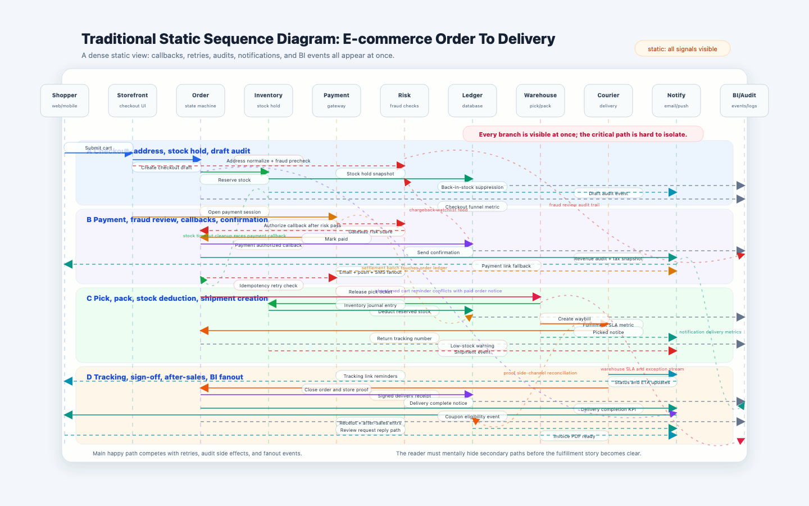

# SeqWalk

**Walk through AI-written code with interactive HTML sequence diagrams.**

AI agents can write code fast, but the execution flow is often slow for humans to review. SeqWalk turns code paths into easy-to-read interactive HTML sequence diagrams, so you can quickly see what runs, in what order, and where data moves.

SeqWalk works as an Agent Skill and template for Claude Code, OpenAI Codex, Cursor, Gemini CLI, and similar tools.

If SeqWalk saves you review time, please consider [buying me a coffee](SUPPORT.md). Tips keep the skill maintained, tested, and published across agent marketplaces.

## Preview

Static sequence diagrams get noisy when callbacks, retries, audits, notifications, and BI events all appear at once. SeqWalk keeps the same e-commerce order flow readable by revealing it step by step as you scroll, while the sticky component rail highlights the services involved in the current step.

- [Live HTML preview](https://raw.githack.com/reason211/seqwalk/main/examples/ecommerce-order-flow.html)
- [Traditional static sequence diagram](examples/traditional-ecommerce-sequence.html)

Both previews use the same `1440x900` frame.

<table>
  <tr>
    <th width="50%">Dense Static Diagram: Everything At Once</th>
    <th width="50%">SeqWalk: Progressive Scroll Highlight</th>
  </tr>
  <tr>
    <td width="50%" valign="top">
      
    </td>
    <td width="50%" valign="top">
      
    </td>
  </tr>
</table>

## What It Does

- Generates a self-contained HTML sequence diagram for a code flow.
- Shows services, functions, stores, queues, caches, and files as participants.
- Makes long flows easier to review with sticky participants and interactive highlights.
- Keeps message lines aligned and validates the result in a browser.
- Helps humans review, debug, and explain AI-generated code.

## Marketplace And One-Click Install

SeqWalk is packaged for plugin-aware AI coding tools:

- Claude Code: `.claude-plugin/plugin.json` and `.claude-plugin/marketplace.json`
- Cursor and Cursor Directory: `.cursor-plugin/plugin.json`, `rules/seqwalk.mdc`, `agents/seqwalk.md`, and `skills/seqwalk/SKILL.md`
- OpenAI Codex: `.codex-plugin/plugin.json` and `skills/seqwalk/SKILL.md`
- Open Plugins-compatible directories: `.plugin/plugin.json` and `.plugin/marketplace.json`

Use this GitHub repository URL when a marketplace or IDE asks for a plugin source:

```text
https://github.com/reason211/seqwalk
```

## Manual Install

From a local clone or downloaded copy:

```bash
cd seqwalk
```

Codex user install:

```bash
mkdir -p ~/.agents/skills
cp -R skills/seqwalk ~/.agents/skills/seqwalk
```

Codex project install:

```bash
mkdir -p /path/to/project/.agents/skills
cp -R skills/seqwalk /path/to/project/.agents/skills/seqwalk
```

Claude local skill install:

```bash
mkdir -p ~/.claude/skills
cp -R skills/seqwalk ~/.claude/skills/seqwalk
```

Claude project skill install:

```bash
mkdir -p /path/to/project/.claude/skills
cp -R skills/seqwalk /path/to/project/.claude/skills/seqwalk
```

Cursor rule install:

```bash
mkdir -p /path/to/project/.cursor/rules
cp adapters/cursor/.cursor/rules/seqwalk.mdc /path/to/project/.cursor/rules/seqwalk.mdc
```

Gemini CLI adapter:

```bash
cp adapters/gemini/GEMINI.md /path/to/project/GEMINI.md
```

If the target project already has `AGENTS.md` or `GEMINI.md`, merge the SeqWalk instructions instead of replacing the file.

Detailed install notes: [docs/INSTALL.md](docs/INSTALL.md).

## Usage

Ask your agent:

```text
Use SeqWalk to inspect this code path and create an interactive HTML sequence diagram.
Focus on what calls what, where data is read or written, and what a reviewer should verify.
Validate the generated HTML in a browser and report alignment deltas.
```

For native skill tools:

```text
Use $seqwalk to diagram this execution flow.
```

## Repository Layout

```text
skills/seqwalk/                            # Native skill bundle
rules/seqwalk.mdc                         # Cursor rule
agents/seqwalk.md                         # Agent definition
.plugin/                                  # Open Plugins-compatible metadata
.claude-plugin/                           # Claude Code plugin and marketplace metadata
.codex-plugin/                            # Codex plugin metadata
.cursor-plugin/                           # Cursor plugin metadata
adapters/                                 # Gemini, Cursor, and generic adapter copies
docs/INSTALL.md                           # Manual install guide
docs/PROMOTION.md                         # Short launch and sharing copy
docs/assets/                              # Screenshots and wallet QR codes
examples/prompt.md                        # Example prompts
examples/ecommerce-order-flow.html        # Interactive HTML demo
examples/traditional-ecommerce-sequence.html
scripts/validate_skill.py                 # Validation helper
```

## Support

SeqWalk is free MIT-licensed software. If it saves you time reviewing AI-written code or helps you understand a messy execution path faster, please consider buying me a coffee. Tips help fund maintenance, browser testing, and new templates.

Full support page: [SUPPORT.md](SUPPORT.md).

| Network | Address | QR |
| --- | --- | --- |
| ETH / BNB Smart Chain (BSC) / Arbitrum One / Base / Optimism / Polygon and other EVM-compatible chains | `0xF459A9D96cAC23fABb3F44E1F4508da7fe24c2f7` |  |
| Solana | `8Q1dAVExNT62TcKowbrDL2DpnDyex77Xw1o9sJ9fAy6e` |  |
| Tron | `TMqU8d1vh7mqjGSPLVMi7MXrCmHX4s6Gj2` |  |

Thank you for supporting open-source agent skills.

## Suggested Topics

```text
sequence-diagram
code-review
ai-coding-agents
agent-skills
claude-code
openai-codex
cursor
gemini-cli
developer-tools
html-template
```

## License

MIT. See [LICENSE](LICENSE).
