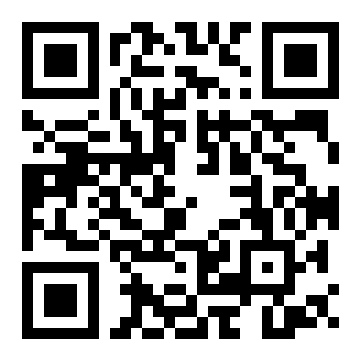
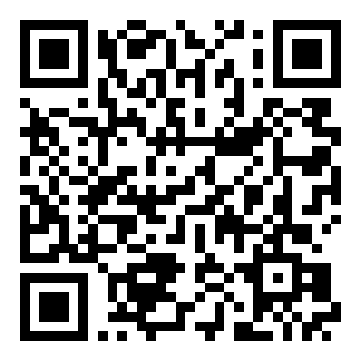
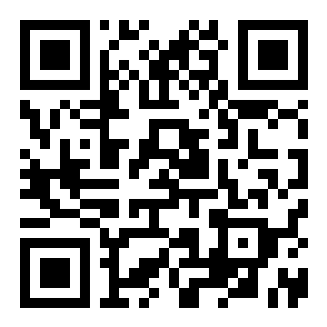

# Support SeqWalk

SeqWalk is free MIT-licensed software. If it saves you time reviewing AI-written code or helps you understand a messy execution path faster, please consider buying me a coffee.

Tips help fund maintenance, browser testing, marketplace submissions, and new templates.

| Network | Address | QR |
| --- | --- | --- |
| ETH / BNB Smart Chain (BSC) / Arbitrum One / Base / Optimism / Polygon and other EVM-compatible chains | `0xF459A9D96cAC23fABb3F44E1F4508da7fe24c2f7` |  |
| Solana | `8Q1dAVExNT62TcKowbrDL2DpnDyex77Xw1o9sJ9fAy6e` |  |
| Tron | `TMqU8d1vh7mqjGSPLVMi7MXrCmHX4s6Gj2` |  |

Thank you for supporting open-source agent skills.
